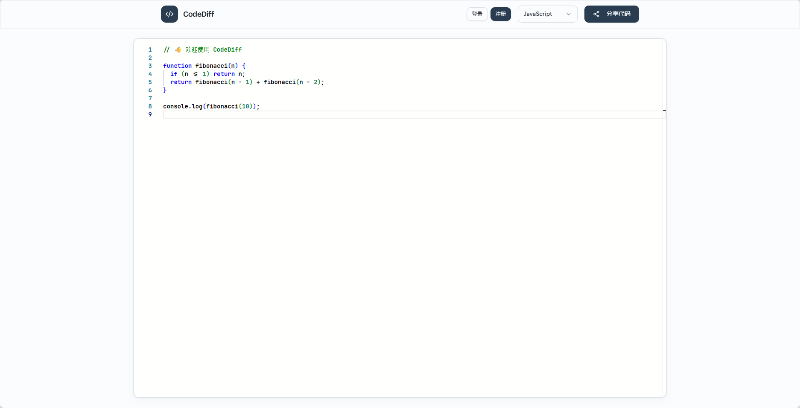
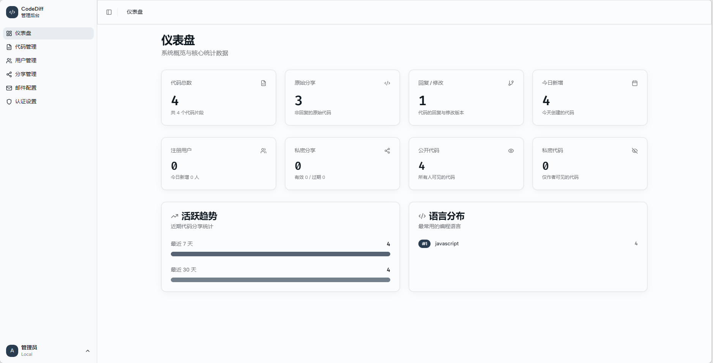
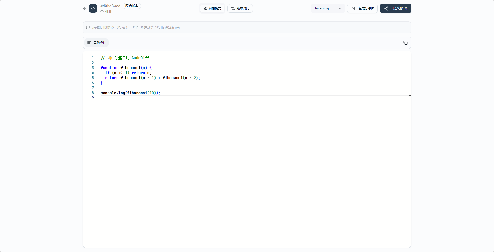
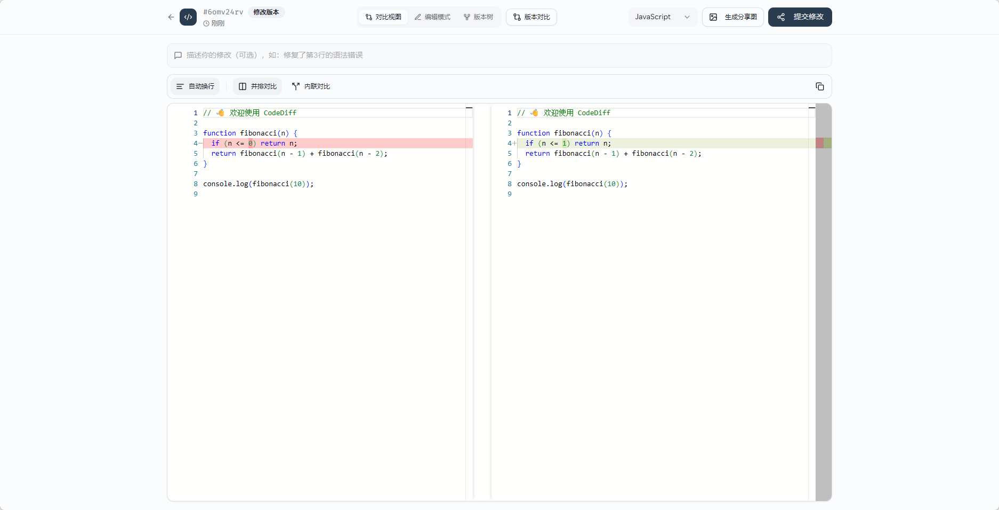
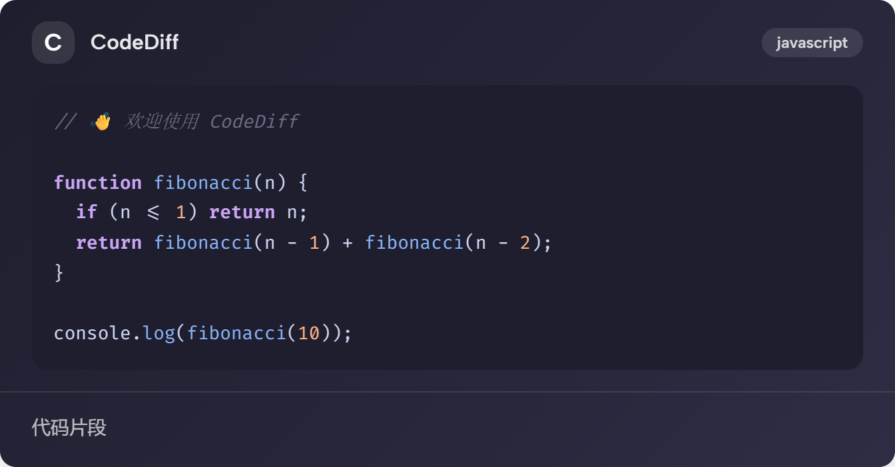

# CodeDiff Lite

一款专为**编程教学与求助场景**打造的轻量级代码片段分享、版本分叉与差异对比平台。
非常适合学生（如大一新生）在学习编程遇到 Bug 时，将代码一键分享给老师或同学；对方修改并提交后，系统会生成版本树，并通过直观的双视窗对比（Diff），让学生一目了然地看到代码错在哪里、被改了什么地方。
同时，它也支持用户权限隔离与私密分享配置，非常适合作为实验室内部的协同小站或个人 Snippet 库。

🚀 **在线预览**：[https://codediff.sixw.de](https://codediff.sixw.de)

## 📸 项目截图

| 首页 | 后台管理 |
|:---:|:---:|
|  |  |

| 分享页 | Diff 对比 |
|:---:|:---:|
|  |  |

| 代码分享 |
|:---:|
|  |

## ✨ 特性 (Features)

*   **💻 沉浸式代码体验**：集成 Monaco Editor（VS Code 核心），提供语法高亮和优雅的代码编辑器交互。
*   **🔄 版本分叉与直观 Diff 对比**：像 GitHub 一样分叉（Fork）代码，老师/同学 修改后，学生可以通过直观的双视窗代码差异对比（Diff Viewer），清晰地看到每一行增删改动的细节。
*   **🔒 灵活的分享控制**：支持公开或私密分享。支持配置阅读次数限制与分享过期时间。
*   **👥 完整的用户系统**：内置用户注册、登录、找回密码、个人资料维护（基于 JWT Auth）。
*   **🛠️ 开箱即用的管理后台**：内置系统统计分析，提供片段管理、用户管理、分享控制和发信邮件（SMTP）的动态配置。
*   **📦 极简部署**：前后端单仓一体化设计，后端直接托管前端构建产物。默认使用 SQLite 持久化，无需额外部署数据库服务。

## 🛠️ 技术栈 (Tech Stack)

*   **后端 / Backend**: Python 3.11+, FastAPI, Pydantic, SQLite (轻量快速的异步 API)
*   **前端 / Frontend**: React 18, TypeScript, Vite, React Query, Tailwind CSS, Monaco Editor

## 🚀 快速开始 (Quick Start)

### 1. 本地开发运行 (Development)

**启动后端：**
```bash
# 1. 创建并激活虚拟环境 (推荐)
python -m venv .venv
# source .venv/bin/activate  # Linux/Mac
.venv\Scripts\activate     # Windows

# 2. 安装依赖
pip install -r requirements.txt

# 3. 环境变量配置
copy .env.example .env

# 4. 启动服务 
python main.py
# 服务将默认运行在: http://localhost:8088
```

**启动前端：**
```bash
cd frontend
npm install
npm run dev
```
> 开发模式下前端默认在 `http://localhost:3000` 运行，并通过 Vite 代理自动转发 `/api` 请求到后端。

### 2. 生产环境构建 (Production Build)

如果你想在本地打包全套服务运行：
```bash
cd frontend
npm ci
npm run build      # 将会在外层根目录生成 static-react/ 存放前端静态产物
cd ..
python main.py     # 启动后的 FastAPI 将会自动接管前端静态文件服务并提供 API 支持
```


## ⚙️ 环境变量设置 (Environment Variables)

关键环境配置说明（可写入 `.env` 中）：

| 变量名 | 描述 | 默认值 | 必填 |
| :--- | :--- | :--- | :--- |
| `CODEDIFF_APP_NAME` | 应用展示名称 | `CodeDiff Lite` | 否 |
| `CODEDIFF_HOST` | FastAPI 绑定 IP | `127.0.0.1` | 否 |
| `CODEDIFF_PORT` | FastAPI 绑定端口号 | `8088` | 否 |
| `CODEDIFF_SECRET_KEY` | JWT 签发密钥 | *见注意* | **是** |
| `CODEDIFF_DB_PATH` | SQLite 数据文件位置 | `snippets.db` | 否 |

**⚠️ 安全警告：** 
请务必在生产环境部署时更改 `CODEDIFF_SECRET_KEY`。可以通过终端执行 `openssl rand -hex 32` 或者 python 生成高强度随机字符串。

## 🔐 管理后台 (Admin Panel)

管理后台入口：`/admin`

首次访问时，系统会引导你设置管理员账号和密码。设置完成后即可使用该账号登录管理后台，进行系统配置、用户管理和片段管理等操作。

## 🩺 健康检查与其他接口
- 查看后端 API 接口文档：`GET /docs` (基于 OpenAPI)
- 服务存活与数据库连通探针：`GET /healthz`

## 🤝 贡献与支持
欢迎通过 Issue 和 Pull Request 提出改进建议或报告问题！- 默认数据库是 SQLite，适合单机或轻量部署；如果要承载更高并发，建议迁移到 PostgreSQL。

## License

本项目采用 MIT 许可证，详情请参见 [LICENSE](LICENSE) 文件。
